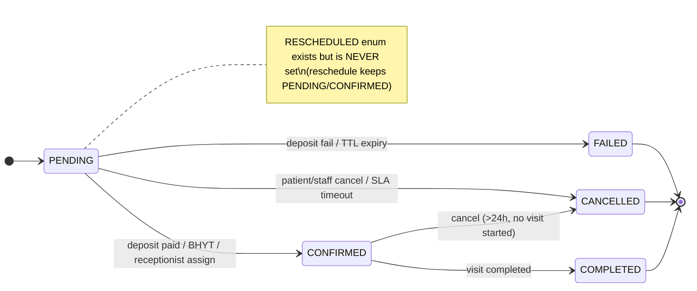
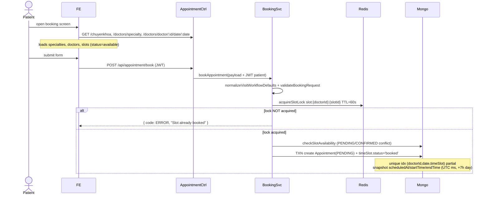
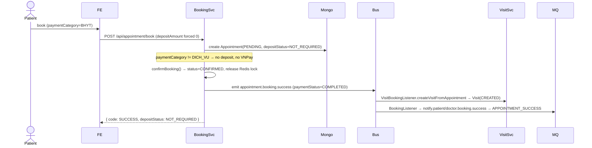
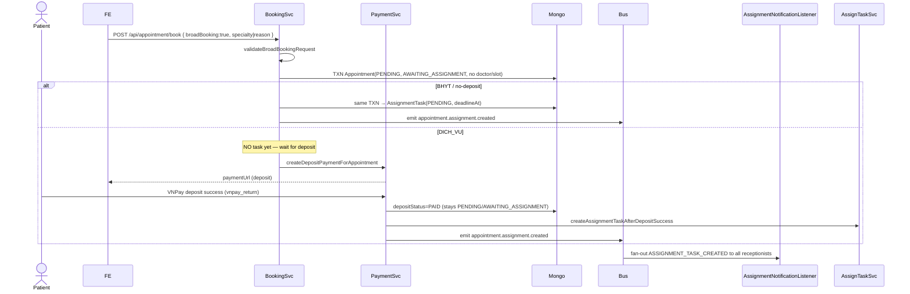
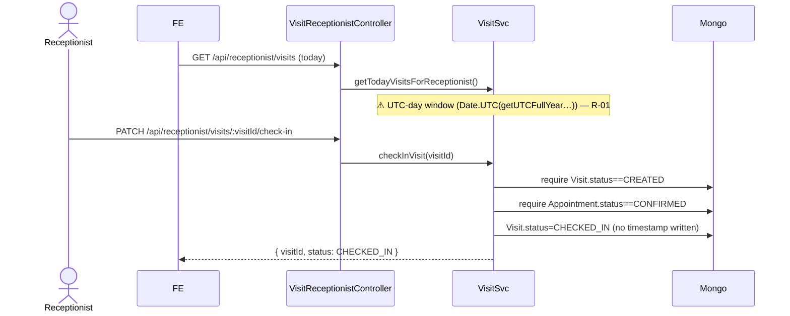
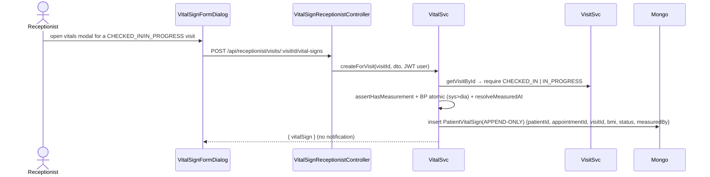
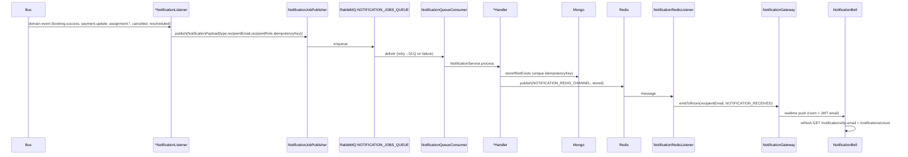

# End-to-End Appointment Lifecycle — Sequence & Risk Analysis

> Status: **Analysis only** (no production code modified).
> Generated: 2026-06-19. Scope: booking → payment → assignment → check-in → vitals → examination → billing → cancel/reschedule/cleanup → notifications.
> Backend repo: `ute-doctor-be` (NestJS 11). Frontend repo: `UTE_DOCTOR_FE` (Next.js, referenced as `FE: src/...`).
> Global API prefix: **`/api`** ([src/main.ts](../src/main.ts#L31) `app.setGlobalPrefix('api')`). All paths below assume this prefix.

## How to read this document

- Every important claim cites a file + class/function. Backend links are clickable from the BE repo root; frontend files live in the separate `UTE_DOCTOR_FE` repo and are written as `FE: src/...`.
- Anything **not directly proven by code** is tagged `inferred`.
- Diagrams use Mermaid `sequenceDiagram`. The master diagram is §11.1; focused sub-diagrams follow.
- Risks are collected in the **Risk Register** (§16E) with IDs `R-01..R-30`; inline callouts reference those IDs.

---

## 0. Participant legend

| Symbol | Real component | Evidence |
|---|---|---|
| Patient / Doctor / Receptionist | Human actors | role guards (`@Roles`) |
| FE | Next.js app (`UTE_DOCTOR_FE`) | `FE: src/lib/axiosClient.ts` baseURL `…/api` |
| AppointmentCtrl | `AppointmentController` | [src/appointment/appointment.controller.ts](../src/appointment/appointment.controller.ts) |
| BookingSvc | `AppointmentBookingService` | [src/appointment/appointment-booking.service.ts](../src/appointment/appointment-booking.service.ts) |
| ApptSvc | `AppointmentService` | [src/appointment/appointment.service.ts](../src/appointment/appointment.service.ts) |
| AssignTaskSvc | `AppointmentAssignmentTaskService` | [src/appointment/appointment-assignment-task.service.ts](../src/appointment/appointment-assignment-task.service.ts) |
| SLA | `AssignmentSlaScheduler` | [src/appointment/appointment-assignment-sla.scheduler.ts](../src/appointment/appointment-assignment-sla.scheduler.ts) |
| PaymentSvc | `PaymentService` | [src/payment/payment.service.ts](../src/payment/payment.service.ts) |
| VNPaySvc / VNPayCtrl | `VnPayPaymentService` / `VnPayPaymentController` | [src/payment/vnpay/vnpay-payment.service.ts](../src/payment/vnpay/vnpay-payment.service.ts), [controller](../src/payment/vnpay/vnpay-payment.controller.ts) |
| VisitSvc | `VisitService` | [src/visit/visit.service.ts](../src/visit/visit.service.ts) |
| BillingSvc | `BillingService` | [src/billing/billing.service.ts](../src/billing/billing.service.ts) |
| VitalSvc | `PatientVitalSignService` | [src/patient-health/patient-vital-sign.service.ts](../src/patient-health/patient-vital-sign.service.ts) |
| EncounterSvc | `MedicalEncounterService` | [src/patient/medical-encounter.service.ts](../src/patient/medical-encounter.service.ts) |
| Bus | `EventEmitter2` (in-process) | injected everywhere |
| MQ | RabbitMQ notification queue | [src/notification/notification-job.publisher.ts](../src/notification/notification-job.publisher.ts) |
| Redis | locks + pub/sub | [src/common/redis/redis.service.ts](../src/common/redis/redis.service.ts) |
| Mongo | MongoDB (Mongoose) | schemas |
| Socket | Socket.IO gateways | [src/socket/base/base.gateway.ts](../src/socket/base/base.gateway.ts) |
| VNPay | External VNPay sandbox | `vnpayHost: sandbox.vnpayment.vn` |

---

## 1. Status vocabularies (state machines)



- **AppointmentStatus**: `PENDING, CONFIRMED, FAILED, CANCELLED, COMPLETED, RESCHEDULED` — [enums/Appointment-status.enum.ts](../src/appointment/enums/Appointment-status.enum.ts). `RESCHEDULED` is **never assigned** anywhere in code (reschedule preserves status, [appointment-reschedule.service.ts:239-301](../src/appointment/appointment-reschedule.service.ts#L239)).
- **DepositStatus**: `NOT_REQUIRED, PENDING, PAID, FAILED, REFUNDED, FORFEITED` — [enums/deposit-status.enum.ts](../src/appointment/enums/deposit-status.enum.ts).
- **AssignmentStatus** (on Appointment): `NONE, AWAITING_ASSIGNMENT, ASSIGNED` — [enums/assignment-status.enum.ts](../src/appointment/enums/assignment-status.enum.ts).
- **AssignmentTaskStatus**: `PENDING, ASSIGNED, COMPLETED, EXPIRED, ESCALATED, CANCELLED` — [enums/assignment-task-status.enum.ts](../src/appointment/enums/assignment-task-status.enum.ts). (`ESCALATED` is defined but never produced — `inferred` dead branch.)
- **VisitStatus**: `CREATED, CHECKED_IN, IN_PROGRESS, COMPLETED, CANCELLED` — [visit/enums/visit-status.enum.ts](../src/visit/enums/visit-status.enum.ts).
- **BillingStatus**: `DRAFT, FINALIZED, PAID` — [billing/billing.schema.ts:5-9](../src/billing/billing.schema.ts#L5).
- **PaymentFlowStatusEnum**: `PENDING, SUCCESS, FAILED` (+ `PaymentPurposeEnum: BILLING, APPOINTMENT_DEPOSIT`) — [payment/enums/payment-flow.enum.ts](../src/payment/enums/payment-flow.enum.ts).
- **PaymentCategory**: `BHYT, DICH_VU` — [enums/payment-category.enum.ts](../src/appointment/enums/payment-category.enum.ts).

---

## 2. Booking lifecycle

Entry: `POST /api/appointment/book` (`@UseGuards(JwtAuthGuard)`), [appointment.controller.ts:76-92](../src/appointment/appointment.controller.ts#L76). The controller **overwrites** `patientEmail`/`patientId` from the JWT (never trusts the body) and forwards to `BookingSvc.bookAppointment(payload, clientIp)`.

`BookingSvc.bookAppointment` ([:80](../src/appointment/appointment-booking.service.ts#L80)):
1. `normalizeVisitWorkflowDefaults` — defaults `visitType=OFFLINE`, `paymentCategory=DICH_VU`; **BHYT forces `depositAmount=0`** ([:1173](../src/appointment/appointment-booking.service.ts#L1173)).
2. If `broadBooking` → `bookBroadAppointment` (§2.D).
3. Else `validateBookingRequest` (doctor, timeSlot, appointmentDate|date, hospitalName, serviceType, paymentMethod, patient context; **COIN method deprecated**; **DICH_VU requires `depositAmount>0`**) ([:1132](../src/appointment/appointment-booking.service.ts#L1132)).

### 2.A General (doctor-specific) flow — common spine



FE loaders: `FE: src/features/appointment/hooks/useAppointmentBooking.ts` → `appointmentService.getAllTimeSlots / getSpecialties / getTimeSlotsByDoctorAndDate / getDoctorsBySpecialty`. Slot fetch defaults to `status=available` (`FE: src/apis/appointment/appointment.api.ts:109`).

Time normalization: FE builds a **zoned ISO** (`buildZonedISO`+`toUTCISOString`, `useAppointmentBooking.ts:631-639`); BE parses once via `TimeHelper.parseISOToUTC` → epoch ms and derives the window with a **+7h (Asia/HCM) offset** (`AppointmentTimeHelper`, [utils/appointment-time.helper.ts:22-37](../src/appointment/utils/appointment-time.helper.ts#L22)). `scheduledAt`, `startTime`, `endTime`, `bookingDate`, `date` are all **epoch-ms numbers** in Mongo ([appointment.schema.ts:18-37](../src/appointment/schemas/appointment.schema.ts#L18)). `date` is deprecated but kept in sync.

### 2.B BHYT / no-deposit booking



- BHYT confirms **immediately at booking**: `confirmBooking` sets `CONFIRMED` ([appointment-booking.service.ts:706-785](../src/appointment/appointment-booking.service.ts#L706)). Because `CONSULTATION_FEE` is normally `>0`, the `finalAmount===0` branch is skipped and BHYT hits the “payment deferred – use billing flow” `confirmBooking` ([:230-252](../src/appointment/appointment-booking.service.ts#L230)).
- **Deposit status after booking**: `NOT_REQUIRED`. **No Payment row is created** for BHYT.
- **Visit creation**: on `appointment.booking.success` → `VisitBookingListener` → `VisitSvc.createVisitFromAppointment` → `Visit(CREATED)`, idempotent on `appointmentId` ([visit.service.ts:268-321](../src/visit/visit.service.ts#L268)).
- **Notifications**: `BookingListener` ([listenners/booking.listenner.ts:13-21](../src/appointment/listenners/booking.listenner.ts#L13)) fans out `APPOINTMENT_SUCCESS` to patient **and** doctor.
- FE: `useAppointmentBooking.handleSubmit` treats `code===SUCCESS` as `CONFIRMED` and shows the BHYT success copy (`useAppointmentBooking.ts:680-690`).

### 2.C DICH_VU doctor-specific + VNPay deposit (happy path)

```mermaid
sequenceDiagram
  actor Patient
  participant FE
  participant BookingSvc
  participant PaymentSvc
  participant Mongo
  participant VNPay
  participant VNPayCtrl
  participant Bus
  participant VisitSvc
  FE->>BookingSvc: POST /api/appointment/book (DICH_VU, depositAmount>0)
  BookingSvc->>Mongo: TXN Appointment(PENDING, depositStatus=PENDING) + slot 'booked'
  BookingSvc->>PaymentSvc: createDepositPaymentForAppointment(amount)
  PaymentSvc->>Mongo: Payment(APPOINTMENT_DEPOSIT, PENDING, expireAt) ; appt.depositPaymentId=payment._id
  PaymentSvc->>VNPay: buildPaymentUrl(txnRef=payment._id)
  BookingSvc->>Bus: emit appointment.booking.pending
  BookingSvc-->>FE: { code: PENDING, paymentUrl, depositPaymentId }
  FE->>FE: open popup(paymentUrl) + poll GET /appointment/:id/deposit-status (3s)
  Patient->>VNPay: pay
  VNPay-->>VNPayCtrl: GET /api/payment/vnpay_return?vnp_*
  VNPayCtrl->>VNPay: verifyReturnUrl (checksum)
  VNPayCtrl->>PaymentSvc: handleVnpayPaymentResultByTxnRef(payment._id)
  PaymentSvc->>Mongo: TXN payment.SUCCESS ; appt.depositStatus=PAID, depositPaidAmount/At
  PaymentSvc->>Mongo: appt.status PENDING→CONFIRMED
  PaymentSvc->>Bus: emit appointment.booking.success + payment.update
  Bus->>VisitSvc: createVisitFromAppointment → Visit(CREATED)
  FE->>BookingSvc: poll deposit-status → depositStatus=PAID & isConfirmed → CONFIRMED
```

Key facts:
- **Slot hold = two layers**: (1) Redis lock `slot:{doctorId}:{timeSlotId}`, TTL `BOOKING_PENDING_TTL_SECONDS = VN_PAY_EXPIRE_MINUTES*60` (env `VN_PAY_EXPIRE_MINUTES=1` ⇒ **60 s**, [vnpay-timeout.config.ts](../src/payment/vnpay/vnpay-timeout.config.ts)); (2) durable `TimeSlotLog.status='booked'` set inside the booking transaction ([appointment-booking.service.ts:590](../src/appointment/appointment-booking.service.ts#L590)). The DB status is the durable guard; the Redis lock only guards the create race.
- **Initial appointment status**: `PENDING`, `depositStatus=PENDING`.
- **VNPay URL**: `txnRef = payment._id` (deposit), `createPaymentUrl` ([payment.service.ts:159-193](../src/payment/payment.service.ts#L134)). Configured return URL = `http://localhost:3001/api/payment/vnpay_return` (BE `.env`) → the **backend** processes the callback and returns JSON.
- **Deposit success** (`markDepositPaymentSuccess`, [payment.service.ts:395-508](../src/payment/payment.service.ts#L395)): payment→SUCCESS, `depositStatus=PAID`, then for a doctor-specific (non-broad) appointment `PENDING→CONFIRMED` and emits `appointment.booking.success` → **Visit(CREATED)**. Emits `payment.update {orderId, COMPLETED}`.
- **Confirmation boundary**: deposit `PAID` + appointment `CONFIRMED`. **Visit is created only here**, never before deposit.
- **Idempotency**: `wasAlreadyPaid` guard ([:431](../src/payment/payment.service.ts#L431)) and `confirmBooking` early-return ([:719-735](../src/appointment/appointment-booking.service.ts#L719)) make repeated callbacks safe. `transactionId==='0'` is normalized away so the unique sparse `transactionId` index is not polluted (`resolveGatewayTransactionId`, [:875](../src/payment/payment.service.ts#L875)) → mitigates **R-12**.

### 2.C′ VNPay failed / cancelled callback

```mermaid
sequenceDiagram
  participant VNPay
  participant VNPayCtrl
  participant PaymentSvc
  participant AssignTaskSvc
  participant Mongo
  VNPay-->>VNPayCtrl: GET /api/payment/vnpay_return (responseCode≠00)
  VNPayCtrl->>PaymentSvc: handleVnpayPaymentFailureByTxnRef(txnRef)
  alt txnRef resolves to APPOINTMENT_DEPOSIT payment
    PaymentSvc->>Mongo: TXN payment.FAILED ; appt.depositStatus=FAILED
    PaymentSvc->>Mongo: if appt.PENDING → FAILED ; release timeSlot 'available'
    opt broad DICH_VU awaiting assignment
      PaymentSvc->>AssignTaskSvc: closeActiveTaskAfterDepositFailure → task CANCELLED
    end
  else txnRef is a BILLING payment
    PaymentSvc-->>VNPayCtrl: returns null (NO state change) ⚠ R-13
  end
  VNPayCtrl-->>VNPay: { code: FAILED }
```

- Failure handler only acts on **deposit** payments; a **failed billing** callback returns `null` and leaves the billing Payment `PENDING` ([payment.service.ts:220-233](../src/payment/payment.service.ts#L220)) → **R-13**.
- Invalid checksum → `BadRequestException` and no mutation ([vnpay-payment.controller.ts:22-27](../src/payment/vnpay/vnpay-payment.controller.ts#L22)).

### 2.D DICH_VU broad booking (no doctor/slot)



- Broad appointment is created `PENDING` + `AWAITING_ASSIGNMENT`, **no doctor/slot** (placeholder `date=scheduledAt=bookingDate=now`) ([appointment-booking.service.ts:288-371](../src/appointment/appointment-booking.service.ts#L288)).
- **Payment-vs-assignment ordering differs by category**:
  - **BHYT / no-deposit** → AssignmentTask created **atomically with the appointment** (assignment opens immediately).
  - **DICH_VU** → deposit is taken **first**; the AssignmentTask is created **after deposit success** in `markDepositPaymentSuccess` → `createAssignmentTaskAfterDepositSuccess` ([payment.service.ts:444-455](../src/payment/payment.service.ts#L444)). This keeps the SLA clock off unpaid tasks.
- **Visit creation is deferred** until a receptionist assigns a doctor/slot (§3).
- FE: broad booking via `bookBroad` (`FE: src/apis/appointment/appointment.api.ts:38`); the deposit poller resolves to **AWAITING_ASSIGNMENT** (not CONFIRMED) because `pendingIsBroadRef` is set (`useAppointmentBooking.ts:225-249`).

---

## 3. Receptionist assignment lifecycle

Endpoints (controller `@Roles(RECEPTIONIST, ADMIN)`; mutations narrowed to `RECEPTIONIST`) — [appointment-assignment-task.controller.ts](../src/appointment/appointment-assignment-task.controller.ts):

| Action | Endpoint | Guard |
|---|---|---|
| List queue | `GET /api/appointment/assignment-tasks?status=&specialty=&page=&limit=` | RECEPTIONIST/ADMIN |
| Detail | `GET /api/appointment/assignment-tasks/:id` | RECEPTIONIST/ADMIN |
| Accept | `POST /api/appointment/assignment-tasks/:id/accept` | RECEPTIONIST |
| Release | `POST /api/appointment/assignment-tasks/:id/release` | RECEPTIONIST |
| Assign doctor/slot | `POST /api/appointment/assignment-tasks/:id/assign` | RECEPTIONIST |

```mermaid
sequenceDiagram
  actor Recep as Receptionist
  participant FE
  participant AssignTaskSvc
  participant Redis
  participant Mongo
  participant Bus
  participant VisitSvc
  loop poll 20s + realtime nudge
    FE->>AssignTaskSvc: GET /assignment-tasks?status=PENDING (FIFO createdAt asc)
  end
  Recep->>AssignTaskSvc: POST :id/accept
  AssignTaskSvc->>Redis: acquireLock assignment-task:{id} (30s)
  AssignTaskSvc->>Mongo: findOneAndUpdate {PENDING}→ASSIGNED (atomic, single winner)
  AssignTaskSvc-->>FE: ASSIGNED (acceptedByReceptionistId=me)
  Recep->>AssignTaskSvc: POST :id/assign {doctorId, timeSlotId, appointmentDate}
  AssignTaskSvc->>AssignTaskSvc: owner check + assignable + DICH_VU deposit PAID + slot∈doctor(Shift)
  AssignTaskSvc->>Redis: acquireSlotLock slot:{doctorId}:{slotId}
  AssignTaskSvc->>Mongo: TXN appt.doctor/slot/schedule set, status=CONFIRMED, assignmentStatus=ASSIGNED
  AssignTaskSvc->>Mongo: timeSlot 'booked' ; task→COMPLETED
  AssignTaskSvc->>Bus: emit appointment.booking.success → Visit(CREATED)
  AssignTaskSvc->>Bus: emit appointment.assignment.completed → APPOINTMENT_DOCTOR_ASSIGNED (patient)
  Bus->>VisitSvc: createVisitFromAppointment
```

- **Task creation**: §2.D (BHYT at booking; DICH_VU after deposit).
- **How a receptionist sees the task**: **both** polling (queue is the source of truth, FE polls every **20 s**, `FE: src/features/receptionist-assignments/screens/AssignmentTasksScreen.tsx:31`) **and** realtime nudge (`ASSIGNMENT_TASK_CREATED/REMINDER/EXPIRED` socket events re-trigger a silent reload, `useAssignmentTaskRealtime.ts`). DB notification fan-out targets **all** receptionist accounts; the Redis presence subset only decides who gets the realtime push ([listenners/assignment.notify.listenner.ts:180-216](../src/notification/listenners/assignment.notify.listenner.ts#L180)).
- **Accept concurrency**: Redis task lock (30 s) + atomic conditional `findOneAndUpdate({status:PENDING})` → exactly one winner; loser gets `TASK_ALREADY_ACCEPTED` / `TASK_LOCK_HELD` ([:146-210](../src/appointment/appointment-assignment-task.service.ts#L146)).
- **Validation before assign** ([:424-526](../src/appointment/appointment-assignment-task.service.ts#L424)): task `ASSIGNED` + owned by caller; appointment still assignable (no doctor/slot, status PENDING/CONFIRMED); **DICH_VU deposit must be `PAID`** else `DEPOSIT_NOT_PAID`; slot exists, not in the past, and belongs to the doctor via `Shift.timeSlots`; transactional conflict re-check on `(doctorId, slot, scheduledAt)`.
- **After assignment**: appointment → `CONFIRMED` + `assignmentStatus=ASSIGNED`; task → `COMPLETED`; slot `booked`; emits `appointment.booking.success` (creates Visit) **and** `appointment.assignment.completed` (patient `APPOINTMENT_DOCTOR_ASSIGNED`).
- **Visit timing**: created **here**, on `appointment.booking.success`.
- **Already-handled / expired / cancelled**: `assertAppointmentAssignable`, atomic task status guards, and the unique active-task partial index (`{appointmentId}` where status∈{PENDING,ASSIGNED}, [schemas/appointment-assignment-task.schema.ts:72-80](../src/appointment/schemas/appointment-assignment-task.schema.ts#L72)) prevent double assignment; a cancelled appointment closes its active task (§8).

---

## 4. Check-in lifecycle



- **Who**: `RECEPTIONIST` only ([visit-receptionist.controller.ts:17-20](../src/visit/visit-receptionist.controller.ts#L17)).
- **Screen/API**: `GET /api/receptionist/visits` then `PATCH /api/receptionist/visits/:visitId/check-in` (FE `TodayVisitsScreen` + `useTodayVisits`).
- **Status transition**: `Visit CREATED → CHECKED_IN` only; **requires Appointment `CONFIRMED`** ([visit.service.ts:365-392](../src/visit/visit.service.ts#L365)). Appointment status is **unchanged** by check-in.
- **Payment requirement**: check-in does **not** re-check deposit/billing; it only relies on the appointment being `CONFIRMED` (which itself implies deposit paid for DICH_VU). So an unpaid/unassigned/cancelled appointment cannot reach check-in (it is never `CONFIRMED` with a `CREATED` Visit).
- **Visit creation vs update**: check-in **updates** an existing Visit; it never creates one.
- **Timestamp**: ❌ **No check-in timestamp** is persisted — the `Visit` schema only has `startedAt`/`completedAt` ([visit/schemas/visit.schema.ts:23-27](../src/visit/schemas/visit.schema.ts#L23)). → **R-05**.
- **Notifications**: none on check-in.
- **Idempotency / double check-in**: **not idempotent** — a second call throws `ConflictException('Visit can only be checked in from CREATED')`. The FE optimistically flips the row to CHECKED_IN and rolls back on error (`useTodayVisits.ts:60-82`).

### Date / time risk analysis (check-in & "today")

| Concern | Finding | Evidence |
|---|---|---|
| Storage format | All appointment times are **epoch-ms numbers** (`scheduledAt/bookingDate/startTime/endTime/date`). `Visit.startedAt/completedAt`, `depositPaidAt`, `cancelledAt`, `deadlineAt` also epoch-ms. **But** `Payment.paidAt/expireAt/createdAt`, `Billing.createdAt`, `MedicalEncounter.dateRecord` are **`Date` objects** → mixed representation across collections. | schemas |
| "Today" for **doctor appointments** | Uses **local (+7h) day** via `AppointmentTimeHelper.getUtcDayRangeForLocalDate()`. ✅ correct. | [appointment.service.ts:114-132](../src/appointment/appointment.service.ts#L114) |
| "Today" for **receptionist & doctor visits** | Uses **server UTC day** `Date.UTC(getUTCFullYear/Month/Date)`. ❌ inconsistent with the local-day rule. | [visit.service.ts:56-75](../src/visit/visit.service.ts#L56) & [:157-176](../src/visit/visit.service.ts#L157) |
| Consequence | For GMT+7, appointments at local `00:00–06:59` (= previous UTC day) or where the local/UTC day diverge near midnight are **bucketed into the wrong day** → a receptionist/doctor "today" list can **miss** valid visits or show yesterday's. **R-01 (High).** |
| FE↔BE contract | FE sends `appointmentDate` as **ISO-8601 with timezone** and asserts it (`assertValidISO`, `ensureHasTimezone`), then converts to UTC. BE parses once to epoch. The project rule (epoch internally, zoned ISO on the wire) is honored for booking/reschedule. |

---

## 5. Vitals / biological indicators lifecycle



- **Screen/API**: `POST /api/receptionist/visits/:visitId/vital-signs` (`@Roles(RECEPTIONIST)`) — [vital-sign-receptionist.controller.ts](../src/patient-health/vital-sign-receptionist.controller.ts). FE `VitalSignFormDialog` + `useVitalSignForm`.
- **Storage**: standalone, append-only collection `patientvitalsigns` ([schemas/patient-vital-sign.schema.ts](../src/patient-health/schemas/patient-vital-sign.schema.ts)). Stores height, weight, **bmi (server-derived)**, systolic/diastolic BP, heart rate, blood type, `measuredAt`, `measuredBy{id,name,role}`, `note`, `status{bmi,bloodPressure,heartRate}`, `source=RECEPTIONIST_CHECK_IN`, `recordState=ACTIVE`.
- **Attached to**: `patientId` + `appointmentId` + `visitId` (all three) — derived from the Visit, never from the client.
- **Multiple per visit**: ✅ allowed (append-only, no unique index on `visitId`).
- **`measuredAt`**: optional, defaults to server `now`; rejected if `> now+5min` or `< scheduledAt-6h` ([patient-vital-sign.service.ts:199-234](../src/patient-health/patient-vital-sign.service.ts#L199)).
- **Validation**: per-field physiological bounds in the DTO (`@Min/@Max`, [dto/create-patient-vital-sign.dto.ts](../src/patient-health/dto/create-patient-vital-sign.dto.ts)); cross-field rules in the service (≥1 measurement; BP atomic; systolic>diastolic). Server classifies `NORMAL/LOW/HIGH`. `ValidationPipe` `whitelist+forbidNonWhitelisted` rejects any server-owned field sent by the FE.
- **Doctor view during exam**: the doctor reads vitals via the **patient-health summary** path (`getHealthSummaryForAccount` returns latest ACTIVE records), but there is **no doctor-scoped "vitals for this visit"** endpoint — `inferred` gap (the doctor exam screen relies on what the FE fetches; no BE join of vitals into the doctor visit payload).
- **Billing/medical record inclusion**: vitals are **not** copied into `MedicalEncounter` (`vitalSigns: []` is written empty, [medical-encounter.service.ts:42-57](../src/patient/medical-encounter.service.ts#L52)) and **not** used in billing. They live only in `patientvitalsigns`.
- **UI "informational, not diagnosis" warning**: `inferred` — not enforced in BE; presence in FE not verified in this pass.
- **Notification**: none on vitals recorded.

Vitals-specific risks: **R-06** (vitals before check-in impossible — guard requires CHECKED_IN/IN_PROGRESS, so this is mitigated), **R-07** (units not stored — `heightCm/weightKg/...bpm` are unit-suffixed field names only; raw numbers have no unit object), **R-08** (`measuredAt` accepts client epoch within the window; potential timezone confusion if FE sends local-as-UTC — mitigated by the ±window but not eliminated).

---

## 6. Doctor examination lifecycle

```mermaid
sequenceDiagram
  actor Doctor
  participant FE
  participant DoctorVisitsCtrl as DoctorVisitsController
  participant VisitSvc
  participant EncounterSvc
  participant Mongo
  participant Bus
  participant BillingSvc
  Doctor->>DoctorVisitsCtrl: GET /api/doctor/visits/today
  Note over VisitSvc: status∈{CHECKED_IN,IN_PROGRESS} ; ⚠ UTC-day window R-01
  Doctor->>DoctorVisitsCtrl: PATCH /api/doctor/visits/:visitId/start
  DoctorVisitsCtrl->>VisitSvc: ownership(visit.doctorId==me) ; CHECKED_IN→IN_PROGRESS (+startedAt)
  Doctor->>DoctorVisitsCtrl: POST /api/doctor/visits/:visitId/complete {diagnosis,note,prescriptions}
  DoctorVisitsCtrl->>VisitSvc: completeVisit (TXN)
  VisitSvc->>EncounterSvc: createVisitEncounter (unique per visit/appointment)
  VisitSvc->>Mongo: timeSlot 'completed' ; Appointment→COMPLETED ; Visit→COMPLETED(+completedAt)
  VisitSvc->>Bus: emit domain.visit.completed
  Bus->>BillingSvc: BillingListener → createDraftBilling
```

- **Today list**: `GET /api/doctor/visits/today` (`@Roles(DOCTOR)`), `getTodayVisitsForDoctor` returns visits with status `CHECKED_IN`/`IN_PROGRESS` ([doctor/doctor-visits.controller.ts:32-46](../src/doctor/doctor-visits.controller.ts#L32), [visit.service.ts:157](../src/visit/visit.service.ts#L157)). **Same UTC-day bug as §4 (R-01).**
- **Visibility**: a visit becomes doctor-visible **after check-in** (CHECKED_IN). The doctor sees it only when assigned (`Visit.doctorId`) and present in the UTC-day window.
- **Start exam**: `PATCH /api/doctor/visits/:visitId/start` — **ownership enforced** (`visit.doctorId === doctorId` else `ForbiddenException`), `CHECKED_IN → IN_PROGRESS`, sets `startedAt`. Idempotent if already IN_PROGRESS; conflict if COMPLETED ([doctor-visits.controller.ts:48-84](../src/doctor/doctor-visits.controller.ts#L48)).
- **Records captured** (`CompleteVisitDto`): `diagnosis`, `note`, `prescriptions[{medicineId,name,quantity,note}]`. **No symptoms / lab-test / follow-up fields exist** in the encounter model → `inferred` gaps. Prescriptions snapshot unit prices at write time (for billing immutability, [medical-encounter.service.ts:66-114](../src/patient/medical-encounter.service.ts#L66)).
- **Complete exam**: `POST /api/doctor/visits/:visitId/complete` (ownership + must be IN_PROGRESS) → `VisitSvc.completeVisit` **single transaction**: create `MedicalEncounter`, slot→`completed`, **Appointment→COMPLETED**, Visit→COMPLETED+`completedAt`, then emit `domain.visit.completed` ([visit.service.ts:394-481](../src/visit/visit.service.ts#L394)). `MedicalEncounter` is **unique per `visitId` and per `appointmentId`** ([medical-record.schema.ts:156-161](../src/patient/schema/medical-record.schema.ts#L156)) → linkage cannot duplicate.
- **Completion triggers billing**: ✅ `domain.visit.completed` → `BillingListener.createDraftBilling` ([billing/billing.listener.ts:10-22](../src/billing/billing.listener.ts#L10)).
- **Completion triggers notification**: ❌ **no** examination-completed notification is emitted (only billing draft + coin reward via the legacy path).
- **Legacy duplicate completion path**: `PATCH /api/appointment/complete` ([appointment.controller.ts:112-115](../src/appointment/appointment.controller.ts#L112)) → `ApptSvc.completeAppointment` → `completeVisitByAppointmentId` + coin reward. **This controller method has NO guard** → **R-15 (anyone can complete a visit by appointmentId)**.
- **Edit completed records**: no update endpoint exists for `MedicalEncounter`; **no audit trail** for edits (none possible) → **R-18**.

---

## 7. Billing lifecycle

```mermaid
sequenceDiagram
  participant Bus
  participant BillingSvc
  participant Recep as Receptionist(FE)
  participant PaymentSvc
  participant VNPay
  participant Mongo
  participant Wallet
  Bus->>BillingSvc: domain.visit.completed → createDraftBilling(visitId)
  BillingSvc->>Mongo: Billing(DRAFT) {consultationFee, medicationFee, insurance(BHYT), depositUsed(if PAID), finalPayable}
  Recep->>BillingSvc: PATCH /receptionist/billings/:id/apply-credit / apply-coin (DRAFT only)
  Recep->>BillingSvc: POST /receptionist/billings/:id/finalize {medications fulfillment}
  BillingSvc->>Mongo: recompute → Billing(FINALIZED)
  BillingSvc->>PaymentSvc: createPaymentForBilling → Payment(BILLING, PENDING, key PAYMENT:{billingId}:ACTIVE)
  alt online QR
    Recep->>PaymentSvc: GET /receptionist/payments/:billingId/qr → VNPay url (txnRef=billingId)
    VNPay-->>PaymentSvc: vnpay_return → markPaymentSuccessByBillingId
  else cash
    Recep->>PaymentSvc: POST /receptionist/payments/:paymentId/mark-paid (channel=CASH)
  end
  PaymentSvc->>Wallet: commit credit + coin spend, reward coin
  PaymentSvc->>Mongo: Payment→SUCCESS ; Billing→PAID
  PaymentSvc->>Bus: emit domain.payment.success + payment.update
```

- **When created**: at **examination completion** (`domain.visit.completed`), **not** at booking/check-in. Owned by **Visit** (`Billing.visitId` unique) — one billing per visit ([billing.schema.ts:20](../src/billing/billing.schema.ts#L20)). Idempotent: existing billing is returned unchanged ([billing.service.ts:61-71](../src/billing/billing.service.ts#L61)).
- **Deposit application**: `depositUsed = depositPaidAmount` **only if `depositStatus===PAID`** (a requested-but-unpaid deposit contributes 0) ([billing.service.ts:140-147](../src/billing/billing.service.ts#L140)). `finalPayable = total − insurance − depositUsed − creditUsed − coinUsed`.
- **BHYT vs DICH_VU**: BHYT applies `insuranceAmount = total × INSURANCE_COVERAGE_RATE`; DICH_VU `insuranceAmount = 0`. `paymentCategory` is snapshotted on the billing and re-read from the appointment at finalize ([billing.service.ts:316-330](../src/billing/billing.service.ts#L316)).
- **Online vs cash**: online → VNPay (`txnRef=billingId`); cash → `POST /receptionist/payments/:paymentId/mark-paid` (`channel=CASH`, method set to CASH) ([receptionist.controller.ts:69-73](../src/receptionist/receptionist.controller.ts#L69)).
- **Amount fields**: `consultationFee, medicationFee, totalAmount, insuranceAmount, depositUsed, creditUsed, coinUsed, finalPayable`. There is **no explicit `refundAmount` on billing** — refund lives on the **deposit/credit** side (§8).
- **Billing status vs deposit status**: independent. `BillingStatus∈{DRAFT,FINALIZED,PAID}`; deposit lifecycle is on the Appointment.
- **Cancel/refund of billing**: ❌ **no billing cancel or refund flow exists.** Once `FINALIZED`/`PAID` there is no reversal endpoint. Cancellation guards even **block** cancelling an appointment once a billing/payment exists ([appointment.service.ts:561-576](../src/appointment/appointment.service.ts#L561)) → **R-16**.
- **Doctor completion → finalization**: completion only creates a **DRAFT**; a receptionist must `finalize` → **R-19** (a completed visit can sit unpaid/undrafted-to-final indefinitely).
- **Receipt/invoice/email**: `inferred` — a PDF static path exists (`public/`), but **no billing email** event is emitted in the analyzed code.
- **Payment success commit**: `markPaymentSuccess` is one transaction that deducts credit/coin, rewards coin, marks billing PAID, emits `domain.payment.success`+`payment.update` ([payment.service.ts:256-393](../src/payment/payment.service.ts#L256)). `alreadyCompleted` guard makes repeated callbacks idempotent.
- ⚠ **Unguarded billing payment success**: `POST /api/payments/:paymentId/success` ([payment/payment.controller.ts:8-11](../src/payment/payment.controller.ts#L8)) calls `markPaymentSuccess` with **no `JwtAuthGuard`/`RoleGuard`** → **R-14 (High)**. Also `POST /receptionist/payment/mock` is a dev backdoor ([receptionist.controller.ts:34-37](../src/receptionist/receptionist.controller.ts#L34)) → **R-17**.

---

## 8. Cancel, reschedule, timeout & cleanup

### 8.1 Patient/staff cancel — `PATCH /api/appointment/cancel` (JwtAuthGuard)

```mermaid
sequenceDiagram
  actor Caller as Patient/Staff
  participant ApptCtrl as AppointmentController
  participant ApptSvc
  participant CreditSvc
  participant Mongo
  participant Bus
  Caller->>ApptCtrl: PATCH /api/appointment/cancel {appointmentId, reason}
  ApptCtrl->>ApptSvc: cancelAppointment(id, reason, JWT user)
  ApptSvc->>ApptSvc: assertCanCancel (staff OR owner) ; status∈{PENDING,CONFIRMED}
  ApptSvc->>ApptSvc: 24h guard (BYPASSED if AWAITING_ASSIGNMENT)
  ApptSvc->>Mongo: TXN deposit/visit/encounter/billing guards
  alt verified PAID DICH_VU deposit
    ApptSvc->>CreditSvc: refundAppointmentCancellation(depositPaid × rate)
    ApptSvc->>Mongo: depositStatus=REFUNDED (or FORFEITED if rate=0)
  end
  ApptSvc->>Mongo: appt=CANCELLED ; visit=CANCELLED ; slot 'available' ; active task CANCELLED
  ApptSvc->>Bus: emit notify/mail/socket.appointment.cancelled
```

- **Who**: staff (`ADMIN`/`RECEPTIONIST`) or the **owning patient** (`assertCanCancelAppointment`, [appointment.service.ts:933-942](../src/appointment/appointment.service.ts#L933)). **There is no separate receptionist/admin/doctor cancel endpoint** — they reuse the same route via role check. Doctor "unavailable" is a **shift-cancel** flow (separate `notify.*.shift.cancelled` events, not appointment cancel).
- **24h policy**: blocks cancel within 24h of `scheduledAt`, **bypassed for `AWAITING_ASSIGNMENT`** (broad appointments have placeholder schedules) ([:434-439](../src/appointment/appointment.service.ts#L434)).
- **Blocking guards** (transactional): multiple deposit payments → `…AMBIGUOUS`; deposit callback `PENDING` → blocked; missing Visit (non-broad) → blocked; Visit completed/started → blocked; encounter/billing/payment exist → blocked ([:502-577](../src/appointment/appointment.service.ts#L502)).
- **Slot release**: `TimeSlotLog` → `available` (must modify exactly 1 or it aborts) ([:628-640](../src/appointment/appointment.service.ts#L628)).
- **Deposit refund**: only for a **verified paid DICH_VU deposit**; refund = `depositPaidAmount × APPOINTMENT_CANCEL_REFUND_RATE` (default 1.0) via `CreditService.refundAppointmentCancellation`; deposit → `REFUNDED` (or `FORFEITED` if rate 0).
- **Assignment task cleanup**: any active task → `CANCELLED` ([:645-672](../src/appointment/appointment.service.ts#L645)).

### 8.2 Reschedule — `PATCH /api/appointment/:id/reschedule` (JwtAuthGuard)

- **Implemented.** Requires an **assigned doctor** (broad not reschedulable), status `PENDING/CONFIRMED`, **Visit must be `CREATED`** (not started), no encounter/billing/payment, slot belongs to doctor, future time; Redis slot lock; updates **schedule snapshot only** and **preserves appointment status** (does NOT set `RESCHEDULED`). Emits `appointment.rescheduled` → notify/mail/socket. **Does not** create a new Visit or touch wallet ([appointment-reschedule.service.ts:39-328](../src/appointment/appointment-reschedule.service.ts#L39)).

### 8.3 Timeouts & cleanup jobs

```mermaid
sequenceDiagram
  participant SLA as AssignmentSlaScheduler(60s)
  participant CleanupTimer as BookingSvc.expirePendingBookings(60s)
  participant Mongo
  participant ApptSvc
  participant Bus
  loop every 60s (Redis-locked)
    SLA->>Mongo: PENDING tasks within reminder window → emit assignment.reminder
    SLA->>ApptSvc: PENDING tasks past deadline+grace → cancelForAssignmentTimeout
    ApptSvc->>Mongo: task EXPIRED ; appt CANCELLED (+refund if paid deposit)
    ApptSvc->>Bus: emit assignment.expired + appointment.cancelled
    SLA->>Mongo: ASSIGNED past acceptTTL → back to PENDING (reclaim)
  end
  loop every 60s
    CleanupTimer->>Mongo: PENDING (non-broad) older than TTL → failBooking (slot released)
    CleanupTimer->>Mongo: broad DICH_VU unpaid-deposit older than TTL → failBroadUnpaidDepositBooking
  end
```

| Mechanism | Status | Evidence |
|---|---|---|
| Redis slot-hold TTL | **Implemented** — `slot:{doctorId}:{slotId}`, TTL `BOOKING_PENDING_TTL_SECONDS` (60 s w/ env). Durable hold = `TimeSlotLog.status`. | [redis.service.ts](../src/common/redis/redis.service.ts), [vnpay-timeout.config.ts](../src/payment/vnpay/vnpay-timeout.config.ts) |
| Booking-pending expiry | **Implemented** — `setInterval 60s` fails stale PENDING (skips `AWAITING_ASSIGNMENT`), plus a second pass for unpaid broad DICH_VU. | [appointment-booking.service.ts:930-1059](../src/appointment/appointment-booking.service.ts#L930) |
| Payment doc auto-expiry | **Implemented** — Mongo TTL index `expireAt` (`expireAfterSeconds:0`) **deletes** unpaid Payment rows. `expireAt = now + (VN_PAY_EXPIRE_MINUTES ?? 15)min`. With env `=1` this is aggressive. | [payment.schema.ts:68-69](../src/payment/schemas/payment.schema.ts#L68), [payment.service.ts:889-892](../src/payment/payment.service.ts#L889) |
| Assignment SLA reminders | **Implemented** — reminder window/interval/grace/accept-TTL configurable. | [sla.scheduler.ts](../src/appointment/appointment-assignment-sla.scheduler.ts), [sla.config.ts](../src/appointment/appointment-assignment-sla.config.ts) |
| Assignment timeout auto-cancel | **Implemented** — PENDING past deadline+grace → appointment auto-cancelled + refund (skips pending-deposit DICH_VU). | [appointment.service.ts:759-923](../src/appointment/appointment.service.ts#L759) |
| Stale ASSIGNED reclaim | **Implemented** — ASSIGNED idle past accept-TTL → PENDING. | [sla.scheduler.ts:139-164](../src/appointment/appointment-assignment-sla.scheduler.ts#L139) |
| Admin escalation (`ESCALATED`) | **Planned / not implemented** — enum value never produced; comment says "future". | enum + listener comments |
| Visit cleanup on cancel | **Implemented** — Visit → CANCELLED in the cancel transaction. | [appointment.service.ts:623-626](../src/appointment/appointment.service.ts#L623) |
| Orphaned tasks after deposit fail | **Partial** — `closeActiveTaskAfterDepositFailure` handles broad DICH_VU; legacy pre-created tasks covered by `failBroadUnpaidDepositBooking`. | [payment.service.ts:545-551](../src/payment/payment.service.ts#L545) |

---

## 9. Notification lifecycle & fan-out



Per-event fan-out (who receives, store, transport):

| Business event | Source event | Recipient(s) | Type / key | Evidence |
|---|---|---|---|---|
| Booking confirmed | `appointment.booking.success` → `notify.patient/doctor.booking.success` | Patient + Doctor | `APPOINTMENT_SUCCESS:{appt}:{email}` | [booking.listenner.ts:13](../src/appointment/listenners/booking.listenner.ts#L13), [appointment.notify.listenner.ts:18-51](../src/notification/listenners/appointment.notify.listenner.ts#L18) |
| Deposit/payment success | `payment.update {COMPLETED}` | Patient | `PAYMENT_SUCCESS:{orderId}:{email}` | [payment.notify.listenner.ts:15-55](../src/notification/listenners/payment.notify.listenner.ts#L15) |
| Awaiting assignment / task created | `appointment.assignment.created` | **All** receptionists (online subset gets realtime) | `ASSIGNMENT_TASK_CREATED:{task}:{email}` | [assignment.notify.listenner.ts:67-99](../src/notification/listenners/assignment.notify.listenner.ts#L67) |
| Assignment reminder | `appointment.assignment.reminder` | All receptionists | `ASSIGNMENT_TASK_REMINDER:{task}:{n}:{email}` | [:101-137](../src/notification/listenners/assignment.notify.listenner.ts#L101) |
| Assignment expired | `appointment.assignment.expired` | All receptionists | `ASSIGNMENT_TASK_EXPIRED:{task}:{email}` | [:139-176](../src/notification/listenners/assignment.notify.listenner.ts#L139) |
| Doctor assigned | `appointment.assignment.completed` | Patient | `APPOINTMENT_DOCTOR_ASSIGNED:{appt}:{email}` | [:238-264](../src/notification/listenners/assignment.notify.listenner.ts#L238) |
| Cancelled | `notify.patient.appointment.cancelled` | Patient (+ Doctor if email present) | `APPOINTMENT_CANCELLED:{appt}:{email}` | [appointment.notify.listenner.ts:157-229](../src/notification/listenners/appointment.notify.listenner.ts#L157) |
| Rescheduled | `notify.patient/doctor.appointment.rescheduled` | Patient + Doctor | `APPOINTMENT_RESCHEDULED:{appt}:{email}` | [:53-102](../src/notification/listenners/appointment.notify.listenner.ts#L53) |
| Check-in / vitals / exam start/complete / billing created/paid | — | **none** | n/a (no notification emitted) | code absence |

- **Receiver identity fields**: stored row has `recipientEmail` (single), `recipientRole`, **and** `receiverEmail: string[]` (the handler writes both, [appointment-success-notification.handler.ts:42-61](../src/notification/handlers/appointment-success-notification.handler.ts#L42)). **Inconsistency**: `getNotificationsByEmail` filters on `receiverEmail` (array) ([notification.service.ts:160-186](../src/notification/notification.service.ts#L160)), `countUnreadByEmail` also on `receiverEmail`, while realtime routing uses `recipientEmail` → **R-26**.
- **Transport**: RabbitMQ job queue (with DLQ + retry, [notification-queue.consumer.ts](../src/notification/notification-queue.consumer.ts)) → DB write (idempotency via unique `idempotencyKey`) → **Redis pub/sub** (`NOTIFICATION_REDIS_CHANNEL`) → `NotificationRedisListener` → Socket.IO `/notification` namespace `emitToRoom(recipientEmail)`.
- **Socket room**: each socket auto-joins its **JWT email room** ([base.gateway.ts:71-93](../src/socket/base/base.gateway.ts#L71)); fan-out targets that room. FE re-checks `isNotificationPayloadForIdentity` before rendering (`FE: src/components/notification/notification-bell.tsx:91-100`).
- **FE refresh**: `NotificationBell` refetches list + unread count on each socket event; resets on `auth-logout`/`user-logged-in` (mitigates cross-login leakage). Assignment events also emit an in-app `ASSIGNMENT_TASKS_CHANGED_EVENT` that nudges the queue screen.

**Notification ownership risks:**
- **R-23 (High)** `GET /api/notifications` ([notification.controller.ts:24-35](../src/notification/notification.controller.ts#L24)) is **unguarded and unscoped** — returns *all* notifications, any caller. (Matches the standing `project_notification_scope_fixes` memo: guard + scope, do not remove.)
- **R-24 (Medium)** `PATCH /api/notifications/:id/read` is `JwtAuthGuard`-protected but has **no ownership check** — any authenticated user can mark any notification read by id ([:76-87](../src/notification/notification.controller.ts#L76)).
- **R-25 (Low)** `payment.update` is broadcast with `emitToAll` on `/payment/vnpay` ([payment.vnpay.gateway.ts:29-33](../src/socket/namespace/payment/payment.vnpay.gateway.ts#L29)) — every connected client receives `{orderId,status}` (low sensitivity, but not scoped).

---

## 10. Cross-cutting: notification message timestamps

Notification reads normalize `createdAt/updatedAt/details.expiresAt/runAt` to **epoch ms** before returning ([notification.service.ts:60-95](../src/notification/notification.service.ts#L60)); FE parses epoch. This is consistent with the "epoch on the wire" rule, but **payload `data` fields** carry mixed types (e.g. cancelled payload `date` may be a `Date`/ISO while `scheduledAt` is epoch, [appointment.service.ts:454-471](../src/appointment/appointment.service.ts#L454)) → **R-02 / R-27**.

---

## 11. Required diagrams

### 11.1 Master end-to-end lifecycle

```mermaid
sequenceDiagram
  actor Patient
  actor Receptionist
  actor Doctor
  participant FE
  participant BookingSvc
  participant PaymentSvc
  participant VNPay
  participant AssignTaskSvc
  participant VisitSvc
  participant EncounterSvc
  participant BillingSvc
  participant Bus
  participant MQ as Notif(MQ→Redis→Socket)

  rect rgb(235,245,255)
  Note over Patient,VNPay: BOOKING
  Patient->>FE: choose flow
  alt BHYT (no deposit)
    FE->>BookingSvc: POST /appointment/book (BHYT)
    BookingSvc->>Bus: booking.success (CONFIRMED) → Visit(CREATED)
  else DICH_VU doctor-specific
    FE->>BookingSvc: POST /appointment/book (DICH_VU)
    BookingSvc->>PaymentSvc: deposit Payment + VNPay url
    Patient->>VNPay: pay
    VNPay->>PaymentSvc: vnpay_return → deposit PAID → CONFIRMED
    PaymentSvc->>Bus: booking.success → Visit(CREATED)
  else broad (no doctor/slot)
    FE->>BookingSvc: POST /appointment/book (broadBooking)
    BookingSvc->>AssignTaskSvc: task PENDING (BHYT now / DICH_VU after deposit)
    Receptionist->>AssignTaskSvc: accept + assign(doctor,slot) → CONFIRMED
    AssignTaskSvc->>Bus: booking.success → Visit(CREATED)
  end
  Bus->>MQ: APPOINTMENT_SUCCESS / DOCTOR_ASSIGNED
  end

  rect rgb(235,255,235)
  Note over Receptionist,Doctor: VISIT DAY
  Receptionist->>VisitSvc: PATCH /receptionist/visits/:id/check-in (CONFIRMED→CHECKED_IN)
  Receptionist->>VisitSvc: POST /receptionist/visits/:id/vital-signs (append-only)
  Doctor->>VisitSvc: PATCH /doctor/visits/:id/start (CHECKED_IN→IN_PROGRESS)
  Doctor->>VisitSvc: POST /doctor/visits/:id/complete
  VisitSvc->>EncounterSvc: MedicalEncounter ; Appointment→COMPLETED ; Visit→COMPLETED
  VisitSvc->>Bus: domain.visit.completed
  end

  rect rgb(255,245,235)
  Note over BillingSvc,VNPay: BILLING
  Bus->>BillingSvc: createDraftBilling
  Receptionist->>BillingSvc: apply-credit/coin → finalize → Payment(PENDING)
  alt online QR
    Receptionist->>VNPay: QR (txnRef=billingId)
    VNPay->>PaymentSvc: vnpay_return → markPaymentSuccessByBillingId
  else cash
    Receptionist->>PaymentSvc: mark-paid (CASH)
  end
  PaymentSvc->>Bus: domain.payment.success (Billing PAID, wallet commit, coin reward)
  end
```

### 11.2 BHYT booking happy path — see §2.B
### 11.3 DICH_VU doctor-specific + VNPay success — see §2.C
### 11.4 DICH_VU broad + payment + receptionist assignment — see §2.D + §3
### 11.5 VNPay failed/cancelled callback — see §2.C′
### 11.6 Receptionist check-in — see §4
### 11.7 Vitals recording — see §5
### 11.8 Doctor examination — see §6
### 11.9 Billing / final payment / refund — see §7 (refund path is deposit-only, §8.1)
### 11.10 Notification fan-out — see §9
### 11.11 Timeout / cleanup — see §8.3
### 11.12 Cancel / reschedule — see §8.1 / §8.2

---

## 12. Table A — Endpoint inventory

> All paths prefixed `/api`. Guard column: `JWT`=`JwtAuthGuard`, `Role(X)`=`RoleGuard`+`@Roles(X)`, `NONE`=no guard.

| Method | Path | Caller | Controller/function | Purpose | Guard | Main entities changed | Risks |
|---|---|---|---|---|---|---|---|
| POST | `/appointment/book` | Patient FE | `AppointmentController.bookAppointment` → `BookingSvc.bookAppointment` | Book (normal/BHYT/broad) | JWT | Appointment, TimeSlotLog, Payment(deposit), AssignmentTask | R-10, R-11 |
| GET | `/appointment/:id/deposit-status` | Patient FE poll | `AppointmentController.getDepositStatus` → `ApptSvc.getDepositStatus` | Poll deposit/confirm | JWT (owner/staff) | none (read-only) | — |
| GET | `/appointment/:id` | FE | `AppointmentController.getAppointmentById` | Appt detail | **NONE** | none | R-22 |
| GET | `/appointment` | FE | `getAllAppointments` | List **all** appts | **NONE** | none | R-22 |
| GET | `/appointment/admin` | Admin | `findAll` | Admin search | **NONE** | none | R-22 |
| GET | `/appointment/patient` | Patient | `getAppointmentsByPatient` | My appts | JWT | none | — |
| GET | `/appointment/today` | Doctor | `getTodayAppointments` | Doctor today (local-day ✅) | JWT | none | — |
| PATCH | `/appointment/complete` | (any) | `completeAppointment` | Legacy complete + coin | **NONE** | Visit, Appointment, Encounter, Coin | R-15 |
| PATCH | `/appointment/cancel` | Patient/Staff | `cancelAppointment` | Cancel + refund | JWT (owner/staff) | Appointment, Visit, TimeSlotLog, Credit, AssignmentTask | R-04, R-16 |
| PATCH | `/appointment/:id/reschedule` | Patient | `rescheduleAppointment` | Reschedule schedule | JWT | Appointment, TimeSlotLog | — |
| PATCH | `/appointment/:id/confirm` | (any) | `confirmAppointment` | Manual confirm | **NONE** | Appointment | R-22 |
| GET | `/appointment/assignment-tasks` | Recep/Admin | `listTasks` | Queue | Role(RECEP,ADMIN) | none | — |
| POST | `/appointment/assignment-tasks/:id/accept` | Recep | `acceptTask` | Lock task | Role(RECEP) | AssignmentTask | — |
| POST | `/appointment/assignment-tasks/:id/release` | Recep | `releaseTask` | Return task | Role(RECEP) | AssignmentTask | — |
| POST | `/appointment/assignment-tasks/:id/assign` | Recep | `assignDoctorAndSlot` | Set doctor/slot | Role(RECEP) | Appointment, TimeSlotLog, AssignmentTask, (Visit via event) | R-03 |
| GET | `/payment/vnpay_return` | VNPay browser | `VnPayPaymentController.vnpayReturn` | Process callback | NONE (checksum-verified) | Payment, Appointment/Billing, wallet | R-11, R-13 |
| GET | `/payment/create_payment_url`, `/payment/:id`, `/payments/:id` | — | deprecated | throws 400 | NONE | none | R-21 (FE still calls `/payments/:id`) |
| POST | `/payments/:paymentId/success` | (any) | `PaymentController.paymentSuccess` | Mark billing paid | **NONE** | Payment, Billing, wallet | **R-14 (High)** |
| GET | `/receptionist/visits` | Recep | `VisitReceptionistController.getTodayVisits` | Today visits | Role(RECEP) | none | R-01 |
| PATCH | `/receptionist/visits/:visitId/check-in` | Recep | `checkIn` → `checkInVisit` | Check in | Role(RECEP) | Visit | R-05 |
| POST | `/receptionist/visits/:visitId/vital-signs` | Recep | `VitalSignReceptionistController.createVitalSign` | Record vitals | Role(RECEP) | PatientVitalSign | R-07, R-08 |
| GET | `/doctor/visits/today` | Doctor | `DoctorVisitsController.getToday` | Doctor visits | Role(DOCTOR) | none | R-01 |
| PATCH | `/doctor/visits/:visitId/start` | Doctor | `startVisit` | Start exam | Role(DOCTOR)+owner | Visit | — |
| POST | `/doctor/visits/:visitId/complete` | Doctor | `completeVisit` | Complete exam | Role(DOCTOR)+owner | Visit, Appointment, Encounter, TimeSlotLog, Billing(event) | — |
| GET | `/billing/:billingId/wallet-summary` | Recep/Admin | `BillingController.getWalletSummary` | Wallet for billing | Role(RECEP,ADMIN) | none | — |
| GET | `/receptionist/billing/:visitId` | Recep | `getBilling` | Billing by visit | Role(RECEP) | none | — |
| PATCH | `/receptionist/billings/:id/apply-credit` | Recep | `applyCredit` | Apply credit (DRAFT) | Role(RECEP) | Billing | — |
| PATCH | `/receptionist/billings/:id/apply-coin` | Recep | `applyCoin` | Apply coin (DRAFT) | Role(RECEP) | Billing | — |
| POST | `/receptionist/billings/:id/finalize` | Recep | `finalizeBilling` | Finalize + create Payment | Role(RECEP) | Billing, Payment | — |
| GET | `/receptionist/payments/:billingId/qr` | Recep | `getQrPayment` | VNPay QR url | Role(RECEP) | Payment | — |
| POST | `/receptionist/payments/:paymentId/mark-paid` | Recep | `markCashPaid` | Cash paid | Role(RECEP) | Payment, Billing, wallet | — |
| POST | `/receptionist/payment/mock` | Recep | `mockPayment` | Dev mock pay | Role(RECEP) | Billing/Payment | R-17 |
| GET | `/notifications` | (any) | `getNotifications` | List ALL notifications | **NONE** | none | **R-23 (High)** |
| GET | `/notifications/by-email` | FE | `getNotificationsByEmail` | My notifications | JWT | none | R-26 |
| GET | `/notifications/count` | FE | `getUnreadCount` | Unread count | JWT | none | R-26 |
| PATCH | `/notifications/:id/read` | FE | `markAsRead` | Mark read | JWT (no owner check) | Notification | **R-24** |

---

## 13. Table B — Event inventory (in-process `EventEmitter2` + Redis/MQ channels)

| Event / channel | Publisher | Consumer | Payload (key fields) | Trigger | Side effects | Risks |
|---|---|---|---|---|---|---|
| `appointment.booking.success` | BookingSvc.confirmBooking / PaymentSvc.markDepositPaymentSuccess / AssignTaskSvc.assign | VisitBookingListener, BookingListener | enriched appointment (+`paymentStatus`) | Confirmation boundary | **Visit(CREATED)**, notify/mail/socket fan-out, `doctor.update-schedule` | R-09 |
| `appointment.booking.pending` | BookingSvc | BookingListener | enriched appointment | DICH_VU deposit created | notify/mail/socket pending | — |
| `appointment.booking.failed` | BookingSvc.failBooking / failBroadUnpaidDepositBooking | BookingListener | `{appointmentId,patientEmail,reason}` | Deposit fail / TTL expiry | notify/mail/socket failed | — |
| `appointment.assignment.created` | BookingSvc (BHYT broad) / PaymentSvc (DICH_VU broad) | AssignmentNotificationListener | `{taskId,appointmentId,specialty,deadlineAt}` | Broad task opens | `ASSIGNMENT_TASK_CREATED` to all receptionists | R-26 |
| `appointment.assignment.reminder` | SLA scheduler | AssignmentNotificationListener | `{taskId,deadlineAt,reminderCount}` | PENDING near deadline | `ASSIGNMENT_TASK_REMINDER` | — |
| `appointment.assignment.expired` | ApptSvc.cancelForAssignmentTimeout | AssignmentNotificationListener | `{taskId,deadlineAt,reasonCode}` | PENDING past deadline+grace | `ASSIGNMENT_TASK_EXPIRED` | — |
| `appointment.assignment.completed` | AssignTaskSvc.assign | AssignmentNotificationListener | `{appointmentId,doctorId,timeSlotId,scheduledAt,patientEmail}` | Assignment done | `APPOINTMENT_DOCTOR_ASSIGNED` (patient) | — |
| `payment.update` | PaymentSvc (deposit & billing success) | PaymentNotificationListener, VnPayGateway | `{orderId,status:'COMPLETED'}` | Payment success | `PAYMENT_SUCCESS` notif + `emitToAll` socket | R-25 |
| `domain.visit.completed` | VisitSvc.completeVisit | BillingListener | `{visitId,encounterId,completedAt}` | Exam complete | `createDraftBilling` | R-19 |
| `domain.payment.success` | PaymentSvc.markPaymentSuccess | (no in-repo consumer found) | `{paymentId,billingId,visitId,appointmentId,...}` | Billing paid | — (`inferred` listener gap) | R-28 |
| `appointment.get.byId` | PaymentNotificationListener | AppointmentListenner | appointmentId | resolve recipient | read appointment | — |
| `notify.patient/doctor.appointment.cancelled` / `.rescheduled` / `.booking.*` | ApptSvc / listeners | AppointmentNotificationListener | enriched/cancel payload | various | enqueue notification jobs | R-27 |
| `socket.appointment.*` | ApptSvc / BookingListener | AppointmentGateway | payload | various | socket emit to email rooms | — |
| `NOTIFICATION_JOBS_QUEUE` (RabbitMQ) | NotificationJobPublisher | NotificationQueueConsumer | NotificationPayload | every notification | DB write + Redis publish (retry→DLQ) | — |
| `NOTIFICATION_REDIS_CHANNEL` (Redis pub/sub) | handlers | NotificationRedisListener | StoredNotificationPayload | after DB write | socket `emitToRoom(recipientEmail)` | — |

---

## 14. Table C — State transition matrix

| Flow | Appt before | Appt after | Deposit before | Deposit after | Task status | Visit status | Billing status | Trigger | Source |
|---|---|---|---|---|---|---|---|---|---|
| BHYT book | — | CONFIRMED | — | NOT_REQUIRED | — | CREATED | — | `POST /appointment/book` | BookingSvc.confirmBooking |
| DICH_VU book | — | PENDING | — | PENDING | — | — | — | `POST /appointment/book` | createAppointmentWithTransaction |
| Deposit paid (doctor-specific) | PENDING | CONFIRMED | PENDING | PAID | — | CREATED | — | `vnpay_return` | markDepositPaymentSuccess |
| Deposit failed/expired | PENDING | FAILED | PENDING | FAILED | (broad)CANCELLED | — | — | callback / cleanup | markDepositPaymentFailed / failBooking |
| Broad book (BHYT) | — | PENDING(AWAITING) | — | NOT_REQUIRED | PENDING | — | — | `POST /appointment/book` | bookBroadAppointment |
| Broad book (DICH_VU) | — | PENDING(AWAITING) | — | PENDING | — | — | — | `POST /appointment/book` | bookBroadAppointment |
| Broad deposit paid | PENDING(AWAITING) | PENDING(AWAITING) | PENDING | PAID | PENDING(created) | — | — | `vnpay_return` | markDepositPaymentSuccess |
| Assign doctor/slot | PENDING/CONFIRMED(AWAITING) | CONFIRMED(ASSIGNED) | PAID/NOT_REQUIRED | unchanged | COMPLETED | CREATED | — | `POST …/assign` | assignDoctorAndSlot |
| Check-in | CONFIRMED | CONFIRMED | unchanged | unchanged | — | CREATED→CHECKED_IN | — | `PATCH …/check-in` | checkInVisit |
| Start exam | CONFIRMED | CONFIRMED | — | — | — | CHECKED_IN→IN_PROGRESS | — | `PATCH …/start` | updateVisitStatus |
| Complete exam | CONFIRMED | COMPLETED | — | — | — | IN_PROGRESS→COMPLETED | —→DRAFT | `POST …/complete` | completeVisit + BillingListener |
| Finalize billing | COMPLETED | COMPLETED | — | — | — | COMPLETED | DRAFT→FINALIZED | `POST …/finalize` | finalizeBilling |
| Billing paid | COMPLETED | COMPLETED | — | — | — | COMPLETED | FINALIZED→PAID | `vnpay_return`/`mark-paid` | markPaymentSuccess |
| Cancel (paid deposit) | PENDING/CONFIRMED | CANCELLED | PAID | REFUNDED/FORFEITED | (active)CANCELLED | CREATED→CANCELLED | — (blocked if exists) | `PATCH /appointment/cancel` | cancelAppointment |
| Assignment timeout | PENDING(AWAITING) | CANCELLED | PAID→REFUNDED / NOT_REQUIRED | REFUNDED | PENDING→EXPIRED | — | — | SLA sweep | cancelForAssignmentTimeout |
| Reschedule | PENDING/CONFIRMED | **unchanged** | unchanged | unchanged | — | CREATED (unchanged) | — | `PATCH …/reschedule` | rescheduleAppointment |

---

## 15. Table D — Data ownership matrix

| Data | Owner entity | Created by | Updated by | Read by | Security guard | Risks |
|---|---|---|---|---|---|---|
| Appointment | Appointment | BookingSvc (patient) | BookingSvc, PaymentSvc, AssignTaskSvc, ApptSvc, RescheduleSvc | Patient(owner), Doctor, Recep, Admin | owner/staff on cancel & deposit-status; **`GET /:id` & list unguarded** | R-22 |
| Deposit Payment | Payment(`APPOINTMENT_DEPOSIT`) | PaymentSvc | VNPay callback, cleanup | ApptSvc.deposit-status | callback checksum; deposit-status owner/staff | R-11 |
| Slot hold | TimeSlotLog.status + Redis lock | BookingSvc/AssignTaskSvc | reschedule, cancel, complete | booking conflict checks | service-internal | R-10 |
| AssignmentTask | AppointmentAssignmentTask | BookingSvc/PaymentSvc | AssignTaskSvc, SLA, ApptSvc | Recep/Admin | Role(RECEP,ADMIN); accept/assign owner | — |
| Visit | Visit | VisitBookingListener (on booking.success) | VisitSvc (check-in/start/complete), cancel | Recep, Doctor(owner) | Role guards; doctor ownership on start/complete | R-09 |
| Vitals | PatientVitalSign | Recep (on visit) | append-only (no update) | patient (summary), recep | Role(RECEP) write; patient reads own (JWT patientId) | R-07 |
| MedicalEncounter | MedicalEncounter | Doctor (complete) | none (no edit endpoint) | doctor, patient | created in doctor-owned TXN | R-18 |
| Billing | Billing(by Visit) | BillingListener | Recep (apply/finalize), PaymentSvc | Recep/Admin | Role(RECEP,ADMIN) | R-16 |
| Billing Payment | Payment(`BILLING`) | BillingSvc.finalize | PaymentSvc / VNPay / cash | recep | `mark-paid` Role(RECEP); **`/payments/:id/success` NONE** | **R-14** |
| Coin/Credit wallet | CoinWallet/CreditWallet | wallet svc | PaymentSvc commit, refund | patient | service-internal | — |
| Notification | Notification | handlers (idempotent) | markAsRead | recipient (by email) | `by-email`/`count` JWT; **global list NONE; read no owner check** | R-23, R-24 |

---

## 16. Table E — Risk register

Severity/Likelihood: H/M/L.

| ID | Area | Description | Evidence | Sev | Lik | Impact | Mitigation | Files |
|---|---|---|---|---|---|---|---|---|
| R-01 | Date/timezone | Receptionist & doctor "today visits" use **server UTC day**; appointment "today" uses **+7h local day** → near-midnight visits mis-bucketed/missed | `Date.UTC(getUTCFullYear…)` vs `getUtcDayRangeForLocalDate` | H | H | Patients vanish from today's queue; missed check-ins/exams | Use `AppointmentTimeHelper.getUtcDayRangeForLocalDate()` in `VisitService` too | [visit.service.ts:56](../src/visit/visit.service.ts#L56),[:157](../src/visit/visit.service.ts#L157) |
| R-02 | Date format | Mixed epoch-ms (Appointment/Visit) vs `Date` (Payment/Billing/Encounter); some notif `data.date` is `Date`/ISO not epoch | schemas + cancel payload | M | M | Off-by-tz comparisons; FE parse bugs | Standardize epoch-ms on the wire; add a serializer | [appointment.service.ts:454](../src/appointment/appointment.service.ts#L454) |
| R-03 | Slot race | Assign doctor/slot relies on Redis lock + TXN conflict re-check; unique idx is `(doctorId,date,timeSlot)` but reschedule/assign also compare `scheduledAt` — mismatch between `date` and `scheduledAt` could weaken the unique guard | partial unique idx vs `$or:[{scheduledAt},{date}]` | M | L | Rare double-book | Make unique index match `scheduledAt`; backfill `date` | [appointment.index.ts](../src/appointment/schemas/appointment.index.ts), [assign:512](../src/appointment/appointment-assignment-task.service.ts#L512) |
| R-04 | Cancel vs payment race | Cleanup (`expirePendingBookings`, 60s) can flip a PENDING DICH_VU appt to FAILED **after** the patient paid but **before** the VNPay callback lands; `markDepositPaymentSuccess` then rejects (status FAILED) → **money taken, no refund** | TTL=`VN_PAY_EXPIRE_MINUTES` (env 1 min) | H | M | Charged-but-failed booking, manual refund | Lengthen TTL; on late success, refund or re-confirm; reconcile job | [appointment-booking.service.ts:930](../src/appointment/appointment-booking.service.ts#L930), [payment.service.ts:423](../src/payment/payment.service.ts#L423) |
| R-05 | Check-in | No `checkedInAt` timestamp persisted | Visit schema has only started/completed | M | H | No check-in audit/SLA metric | Add `checkedInAt` epoch on check-in | [visit.schema.ts:23](../src/visit/schemas/visit.schema.ts#L23) |
| R-06 | Vitals timing | Vitals require CHECKED_IN/IN_PROGRESS (cannot record before check-in or after complete) | guard | L | — | (mitigated) | keep guard | [patient-vital-sign.service.ts:74](../src/patient-health/patient-vital-sign.service.ts#L74) |
| R-07 | Vitals units | No explicit unit metadata; relies on field-name suffixes | DTO/schema | L | M | Misread values if FE renames | Document contract; FE field-name lock (already in api) | [create-patient-vital-sign.dto.ts](../src/patient-health/dto/create-patient-vital-sign.dto.ts) |
| R-08 | Vitals `measuredAt` | Accepts client epoch within ±window; FE could send local-as-UTC | `resolveAndValidateMeasuredAt` | M | M | Wrong measurement time | Require zoned ISO or document epoch-UTC | [patient-vital-sign.service.ts:199](../src/patient-health/patient-vital-sign.service.ts#L199) |
| R-09 | Visit before doctor | `createVisitFromAppointment` requires `doctorId`+`patientId`; broad appt has none until assign → Visit only after assignment (correct), but `booking.success` is emitted from 3 places — duplicate delivery handled by unique `appointmentId` | unique idx + 11000 catch | L | L | (mitigated) duplicate event safe | keep idempotency | [visit.service.ts:282](../src/visit/visit.service.ts#L282) |
| R-10 | Slot hold TTL | Redis lock TTL only 60s (env), but durable hold = `TimeSlotLog.status='booked'`; if a booking crashes between TXN and confirm, slot stays 'booked' until cleanup fails the appt | lock vs DB status | M | L | Temporarily blocked slot | cleanup job covers it; shorten gap | [appointment-booking.service.ts:128](../src/appointment/appointment-booking.service.ts#L128) |
| R-11 | Callback idempotency | VNPay return is GET, not signed-by-us beyond checksum; replays handled by status guards; **but** the endpoint mutates wallet/billing on a GET | `vnpay_return` | M | L | Replay safe via guards; GET side-effects | Prefer IPN POST; keep idempotency keys | [vnpay-payment.controller.ts:19](../src/payment/vnpay/vnpay-payment.controller.ts#L19) |
| R-12 | VNPay txn "0" | `transactionId='0'` for cancelled attempts collided with unique sparse index | `resolveGatewayTransactionId` treats '0' as none | L | — | (mitigated) | keep normalization | [payment.service.ts:875](../src/payment/payment.service.ts#L875) |
| R-13 | Billing fail callback | Failed **billing** VNPay callback does nothing (returns null); Payment stays PENDING | `handleVnpayPaymentFailureByTxnRef` only handles deposit | M | M | Stuck PENDING billing payment; TTL may delete it | Handle billing failure → mark FAILED, keep audit | [payment.service.ts:220](../src/payment/payment.service.ts#L220) |
| R-14 | Auth | `POST /payments/:paymentId/success` has **no guard** → anyone can mark a FINALIZED billing PAID + commit wallet | controller has no `@UseGuards` | H | M | Financial fraud / free payment | Add JWT+Role(RECEP/ADMIN) or remove | [payment/payment.controller.ts:8](../src/payment/payment.controller.ts#L8) |
| R-15 | Auth | `PATCH /appointment/complete` has **no guard** → anyone can complete any visit by appointmentId + trigger billing/coin | controller method lacks guard | H | M | Forged completion, billing creation | Add Role(DOCTOR)+ownership; or deprecate (doctor route exists) | [appointment.controller.ts:112](../src/appointment/appointment.controller.ts#L112) |
| R-16 | Billing | No billing cancel/refund flow; cancel is blocked once billing/payment exist; refund only on deposit | cancel guards + no refund endpoint | M | M | No way to reverse an over/wrong charge | Add billing void/refund with audit | [appointment.service.ts:561](../src/appointment/appointment.service.ts#L561) |
| R-17 | Backdoor | `POST /receptionist/payment/mock` mock-pays | controller | M | L | Test path in prod marks paid | Gate behind non-prod flag | [receptionist.controller.ts:34](../src/receptionist/receptionist.controller.ts#L34) |
| R-18 | Audit | `MedicalEncounter` has no edit endpoint and no edit audit trail | no update path | M | L | Cannot correct records; no history | Add correction flow + audit (mirror vitals ADR-0002) | [medical-record.schema.ts:156](../src/patient/schema/medical-record.schema.ts#L156) |
| R-19 | Billing lag | Completion creates DRAFT only; finalize is manual | BillingListener | L | M | Unpaid completed visits linger | Dashboard for unfinalized billings | [billing.listener.ts:18](../src/billing/billing.listener.ts#L18) |
| R-20 | Slot lock release | Redis lock release is GET-then-DEL (not atomic Lua) | `tryReleaseLock` | L | L | Tiny race could delete another holder's lock | Use Lua compare-and-del | [redis.service.ts:124](../src/common/redis/redis.service.ts#L124) |
| R-21 | FE/BE drift | FE `paymentResultService` calls deprecated `GET /payments/:orderId` (BE throws 400) | FE `payment.api.ts` → BE deprecated | M | M | Payment-result polling path errors out | Point FE to `/appointment/:id/deposit-status` or remove | [vnpay-payment.controller.ts:91](../src/payment/vnpay/vnpay-payment.controller.ts#L91), FE `payment.api.ts:10` |
| R-22 | Auth | `GET /appointment`, `/appointment/:id`, `/appointment/admin`, `PATCH /:id/confirm` are unguarded | controller | M | M | PII/appointment enumeration; manual confirm abuse | Add JWT + role/owner scoping | [appointment.controller.ts:41](../src/appointment/appointment.controller.ts#L41) |
| R-23 | Notif leak | `GET /notifications` unguarded + unscoped returns all | controller | H | M | Cross-user notification disclosure | Add JWT + scope to recipient (per memo) | [notification.controller.ts:24](../src/notification/notification.controller.ts#L24) |
| R-24 | Notif leak | `PATCH /notifications/:id/read` no ownership check | controller | M | M | Mark others' notifications read | Verify recipient before update | [notification.controller.ts:76](../src/notification/notification.controller.ts#L76) |
| R-25 | Notif leak | `payment.update` `emitToAll` broadcasts `{orderId,status}` | gateway | L | H | Order ids leak to all sockets | Scope to patient room | [payment.vnpay.gateway.ts:29](../src/socket/namespace/payment/payment.vnpay.gateway.ts#L29) |
| R-26 | Consistency | `receiverEmail[]` (queried) vs `recipientEmail` (routed) dual fields | service vs handler | M | M | Count/list vs realtime mismatch | Converge on one field | [notification.service.ts:167](../src/notification/notification.service.ts#L167) |
| R-27 | Notif payload | Cancelled/rescheduled `data` mixes `Date`/ISO and epoch | listeners | L | M | FE parse inconsistency | Normalize to epoch | [appointment.notify.listenner.ts:157](../src/notification/listenners/appointment.notify.listenner.ts#L157) |
| R-28 | Event | `domain.payment.success` has no in-repo consumer | grep | L | L | Intended side-effect (e.g., receipt/email) may be missing | Confirm intended consumer | [payment.service.ts:370](../src/payment/payment.service.ts#L370) |
| R-29 | Broad cancel | Broad appt cancel bypasses 24h + missing-visit guards by design; relies on `assignmentStatus` flag staying correct | `isAwaitingAssignment` | L | L | If flag drifts, guard logic diverges | Assert invariant `AWAITING_ASSIGNMENT ⇒ no doctor/slot` | [appointment.service.ts:421](../src/appointment/appointment.service.ts#L421) |
| R-30 | Payment TTL | Mongo TTL on `Payment.expireAt` (`expireAfterSeconds:0`) **deletes** unpaid payment rows; with `VN_PAY_EXPIRE_MINUTES=1` very aggressive → lost audit + deposit-status poll returns null | TTL index + expireAt | M | M | Disappearing payment audit; confusing poll result | Soft-expire (status FAILED) instead of TTL delete; raise minutes in prod | [payment.schema.ts:68](../src/payment/schemas/payment.schema.ts#L68) |

---

## 17. Final response

**1. Document:** `docs/end-to-end-appointment-lifecycle-sequence.md` (this file, created).

**2. Main source files inspected (backend):**
`appointment.controller.ts`, `appointment-booking.service.ts`, `appointment.service.ts`, `appointment-reschedule.service.ts`, `appointment-assignment-task.service.ts` + `.controller.ts`, `appointment-assignment-sla.scheduler.ts`/`.config.ts`, `appointment-time.helper.ts`, schemas (`appointment`, `appointment-assignment-task`, `appointment-enriched`), `payment.service.ts`, `payment.controller.ts`, `vnpay-payment.controller.ts`/`service.ts`, `vnpay-timeout.config.ts`, `payment.schema.ts`, `visit.service.ts`, `visit-receptionist.controller.ts`, `doctor-visits.controller.ts`, `visit-booking.listenner.ts`, `visit.schema.ts`, `billing.service.ts`/`.controller.ts`/`.listener.ts`/`.schema.ts`, `receptionist.controller.ts`, `patient-vital-sign.service.ts` + controller + schema + DTO, `medical-encounter.service.ts`, `medical-record.schema.ts`, `notification.service.ts`/`.controller.ts`/`.schema.ts`, notification listeners (appointment/assignment/payment), `notification-job.publisher.ts`/`queue.consumer.ts`, `appointment-success-notification.handler.ts`, `notification-redis.listenner.ts`, gateways (`base`, `notification`, `appointment-result`, `payment.vnpay`), `redis.service.ts`, listeners (`booking`, `appointment`), `main.ts`, `auth-user.ts`.
**Frontend:** `useAppointmentBooking.ts`, `appointment.api.ts`, `assignment-task.api.ts`, `payment.api.ts`, `usePaymentStatus.ts`, `PaymentResultScreen.tsx`, `payment-result/page.tsx`, `payment-result.service.ts`, `AssignmentTasksScreen.tsx`, `useAssignmentTaskRealtime.ts`, `useTodayVisits.ts`, `useVitalSignForm.ts`, `receptionist-visit.service.ts`, `receptionist.api.ts`, `notification-bell.tsx`, `axiosClient.ts`.

**3. The real lifecycle (10–15 lines):**
1. Patient books via `POST /api/appointment/book`; the controller injects patient identity from the JWT.
2. **BHYT** confirms immediately (no deposit, no Payment row); **DICH_VU** creates a `PENDING` appointment + a deposit `Payment` + a VNPay URL.
3. Slots are held by a Redis lock (60 s) plus a durable `TimeSlotLog.status='booked'` set inside a transaction; a unique partial index guards double-booking.
4. VNPay redirects to the **backend** `GET /api/payment/vnpay_return`; on success the deposit is marked `PAID` and the appointment `CONFIRMED`.
5. The **Visit (CREATED)** is created only at the confirmation boundary, via the `appointment.booking.success` event (3 emitters, idempotent on `appointmentId`).
6. **Broad** bookings create no doctor/slot; BHYT opens an AssignmentTask at booking, DICH_VU opens it after deposit success; a receptionist accepts (atomic lock) and assigns a doctor/slot, which confirms the appointment and creates the Visit.
7. An SLA scheduler (60 s, Redis-locked) reminds, expires (auto-cancel + refund), and reclaims stale tasks.
8. Receptionist **check-in** moves Visit `CREATED→CHECKED_IN` (requires appointment `CONFIRMED`; no timestamp, not idempotent, no notification).
9. Receptionist records **append-only vitals** (CHECKED_IN/IN_PROGRESS only) into a standalone `patientvitalsigns` collection.
10. Doctor starts (`CHECKED_IN→IN_PROGRESS`, ownership-checked) and completes the visit in one transaction → `MedicalEncounter`, Appointment `COMPLETED`, Visit `COMPLETED`, `domain.visit.completed`.
11. That event creates a **DRAFT billing** (owned by Visit); receptionist applies credit/coin, finalizes (creates a billing Payment), and collects via VNPay QR or cash.
12. Cancel/reschedule are guarded by visit/encounter/billing state; cancel refunds only a verified paid deposit; reschedule preserves status and never creates a new Visit.
13. Notifications fan out via RabbitMQ → DB (idempotency key) → Redis pub/sub → Socket.IO email rooms; the FE bell polls + listens and re-scopes on login/logout.
14. Time is stored as **epoch-ms** for appointments/visits but as `Date` for payments/billing/encounters — a real inconsistency.
15. "Today" windows diverge: appointments use **local (+7h)** day, but receptionist/doctor **visits** use **UTC** day — the most impactful date bug.

**4. Top 10 highest-risk issues:**
1. **R-14** Unguarded `POST /payments/:paymentId/success` — anyone can mark a billing paid (financial fraud).
2. **R-15** Unguarded `PATCH /appointment/complete` — anyone can complete a visit + trigger billing/coin.
3. **R-23** Unguarded/unscoped `GET /notifications` — cross-user notification disclosure.
4. **R-01** UTC-vs-local "today" mismatch for receptionist/doctor visit lists — missed check-ins/exams.
5. **R-04** Cancel/cleanup vs late VNPay success race — patient charged but appointment FAILED with no auto-refund.
6. **R-30** Mongo TTL deletes unpaid Payment rows (aggressive with `VN_PAY_EXPIRE_MINUTES=1`) — lost audit + null deposit-status.
7. **R-13** Failed **billing** VNPay callback is a no-op — billing payment stuck PENDING.
8. **R-22** Unguarded appointment read/list/confirm endpoints — PII enumeration + manual confirm abuse.
9. **R-24** `PATCH /notifications/:id/read` has no ownership check.
10. **R-16** No billing cancel/refund path; cancel is blocked once billing exists — no way to reverse a wrong charge.

**5. Questions needing owner confirmation:**
- Is the VNPay **return URL** meant to hit the backend (current `.env`) with the popup showing JSON, while the `/payment-result` FE page is reserved for billing/QR? The FE `payment-result` polling calls a **deprecated** endpoint (R-21) — is that page still in use?
- Is `PATCH /appointment/complete` (unguarded) deprecated in favor of `POST /doctor/visits/:id/complete`? Can it be removed?
- Production value of `VN_PAY_EXPIRE_MINUTES` (dev `.env` is `1`)? It drives slot TTL, payment TTL-delete, and the cancel-race window.
- Intended consumer of `domain.payment.success` (receipt/email)? Currently none found (R-28).
- Should `ESCALATED` assignment-task escalation be implemented, or is auto-cancel-on-timeout the final design?
- Should vitals be visible to the doctor through a visit-scoped endpoint, and surfaced into the medical record/billing, or remain summary-only?

**6. Diagram provenance:** All sequence diagrams are **derived directly from code** (controllers, services, listeners, schemas, gateways). Items explicitly tagged `inferred` (e.g., the exact VNPay→FE redirect surface for the `/payment-result` page, the "vitals are informational" UI warning, the unused `ESCALATED`/`domain.payment.success` paths, and any doctor-scoped vitals view) are **not** fully proven by code and are flagged inline. Everything else is backed by the cited `file:line` references.
